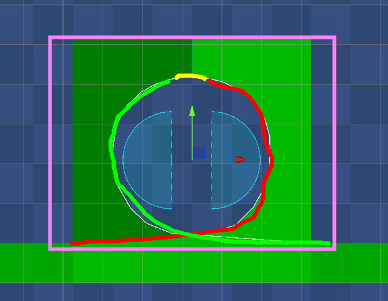

# 2D Slopes and Loops in Unity 2023

This is an implementation for June 2024's Mechanically Challenged using Unity 2023's 2D Physics engine.

You can play the sample project here: [LINK](https://captaincoderorg.github.io/SlopesAndLoops-Impl/)

## Unity Package / Source Code

I have provided a Unity Package that can be imported into a 2D Core project: [CaptainCoder.SlopesAndLoops.unitypackage](CaptainCoder.SlopesAndLoops.unitypackage)

Contents:

* NoFriction.physicsMaterial2D - A 2D Physics material with 0 friction
* Slopes and Loops Demo.scene - A Demo Scene
* Materials/ - A single material used to create a tiling checkered background
* Prefabs/ - Prefabs for the slopes and loops
* Scripts/ - Several MonoBehaviour's used for the demo
* Sprites/ - Sprites for Slopes and Loops

## Approach: Slopes

### Following the Slope of the Ground

The image below shows a simple player controller that accelerates the player toward the world's "Left / Right"
(`Vector2.left` / `Vector2.right`). *Note*: The green line shows the player's velocity.


To follow the slope more closely, we can calculate the player's relative "Left / Right" to the ground and update the
player's velocity whenever the slope of the ground beneath the player changes. The image below shows this in action:


### Snapping to Ground

In most cases, we could stop here. However, if the player's speed is too great, they can detach from the ground. In the
image below, we see the player detaching from a steep curve and "launching" into the air.


If this is not the desired behaviour, we can add in a check that "snaps" the player to the ground if they have moved too
far. In the image below, you can see small red marks. These show the "correction" where the player is being moved to the
ground.


### Detach if Upside Down

By introducing a snap to ground, this allows the player to travel while upside down.


If this behaviour is not desired, we can add a check such that the player only snaps to the ground if their relative
"Up" is not considered upside down.


### FixedUpdate

Because this relies on Unity's 2D Physics system, we put the code in `FixedUpdate`. Here is that method:

```csharp
void FixedUpdate()
{
    RaycastHit2D hit = Physics2D.Raycast(transform.position, -Up, _colliderExtents + SnapDistance, _groundLayer);
    // Use raycast to determine if we are touching the ground
    IsGrounded = hit.collider != null;

    // If the player is touching the ground and is not upside down, snap them to the ground
    if (IsGrounded && !IsUpsideDown) { SnapTo(hit.collider); }

    // If the player is touching the ground, adjust the player's Up direction to match the surface of the ground
    if (IsGrounded) { SetPlayerUp(hit.normal); }
    // Otherwise, clear the ground
    else { ClearGround(); }

    // If the player is running up a wall (or upside down) and they are moving too slow, they fall.
    if (IsGrounded && IsVertical && _rigidbody.velocity.magnitude < FallThreshold) { ClearGround(); }
}
```

`SetPlayerUp` sets the player's relative Up direction based on the ground beneath them. **Note**: TargetMomentum is the direction of input the player is currently pressing (e.g. Left / Right).

```csharp
private void SetPlayerUp(Vector2 newUp)
{
    const float rotateThreshold = 80;
    // Don't change the rotation on sharp corners (let's the player launch into the air)
    if (Up == newUp || Vector2.Angle(Up, newUp) > rotateThreshold) { return; }

    // Sets the player's Up and Right directions, and rotates the player to match
    Up = newUp;
    Right = Quaternion.Euler(0, 0, -90) * Up;
    transform.rotation = Quaternion.Euler(0, 0, Vector2.SignedAngle(Vector2.up, Up));

    if (TargetMomentum == SignOrZero(_rigidbody.velocity.x))
    {
        // If the target momentum is the same as the direction the player is actually moving,
        // snap the player's current velocity to match their direction of travel.
        _rigidbody.velocity = _rigidbody.velocity.magnitude * TargetMomentum * Right;
    }
}
```

`SnapTo` ensures that the player is touching the ground.

```csharp
private void SnapTo(Collider2D ground)
{
    // Find the distance to the ground
    ColliderDistance2D distance = ground.Distance(_collider);
    // If we are already touching the ground, do nothing
    if (distance.isOverlapped) { return; }
    // Otherwise, move the player to the collider
    transform.position += (Vector3)(distance.normal * distance.distance);
    if (ShowDebugInfo)
    {
        Debug.DrawLine(distance.pointA, distance.pointB, Color.red, 1);
    }
}
```

## Approach: Loops

With the SlopedGroundController in place, the player can move through curved surfaces without any additional
modifications to the player's movement. However, we need to ensure the player only collides with the loop under certain
conditions.

To accomplish this, we use a loop with 3 edge colliders and a box trigger. When the player enters the trigger, we
determine which of the surfaces to turn on. Then, as the player passes the "top" of the loop, the colliders change.



Here is the script that determines which side of the loop to turn on when the player is approaching.

```csharp
public void OnTriggerEnter2D(Collider2D collider)
{
    if (collider.GetComponent<PlayerMovementController>() == null) { return; }
    float firstDistance = Vector2.Distance(FirstEntry.position, collider.gameObject.transform.position);
    float secondDistance = Vector2.Distance(SecondEntry.position, collider.gameObject.transform.position);
    if (firstDistance < secondDistance)
    {
        FirstRamp.enabled = true;
        SecondRamp.enabled = false;
    }
    else
    {
        SecondRamp.enabled = true;
        FirstRamp.enabled = false;
    }
}
```

Here is the script that toggles the loop when the player passes the "top" point:

```csharp
public void OnCollisionEnter2D(Collision2D collider)
{
    Left.enabled = !Left.enabled;
    Right.enabled = !Right.enabled;
}
```

These same scripts can be used for additional loop types:


### Bugs and Further Development

Although these loops work under most common conditions. It is possible to "break" them if you try hard enough to cause
the colliders to toggle on / off. I believe this could be fixed by using AreaEffectors along with collision layer's that
are toggled on and off in the SlopedGroundController rather than toggling the collider on and off directly on the loop.